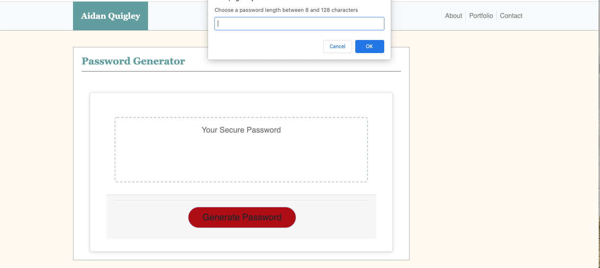

# 03 JavaScript: Password Generator

The goal of this project was to gain an exposure to javascript. To do this we created a password generator that would take inputs from the user and output a password on the screen. this process of asking the user for inputs would be initiated by a button click event. included below is a screenshot of the password generator in action.

